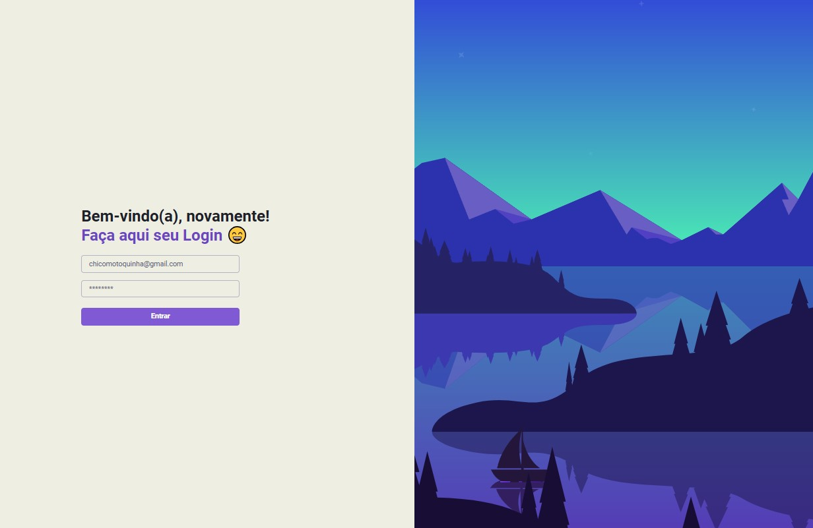

# Tela de Autenticação

## Preview da aplicação: 

<bt/>

## Sobre: 
Este projeto foi desenvolvido durante um evento da **Rocketseat** como parte do **Chapter IV** do programa **Ignite**. O foco foi implementar uma aplicação que realiza autenticação e autorização utilizando tecnologias modernas e boas práticas no desenvolvimento web.

## Tecnologias Utilizadas 💻
- **React**: Biblioteca para criação de interfaces do usuário.
- **Next.js**: Framework React para renderização server-side e geração estática.
- **Axios**: Biblioteca para realizar requisições HTTP.
- **JWT**: Utilizado para autenticação e autorização.
- **MirageJS**: Simulação de API para desenvolvimento front-end.
